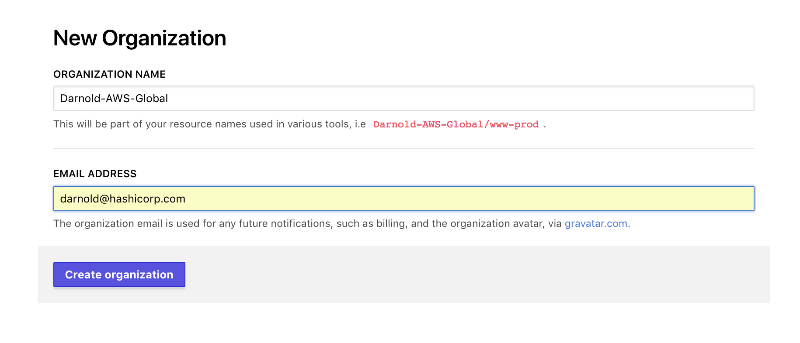
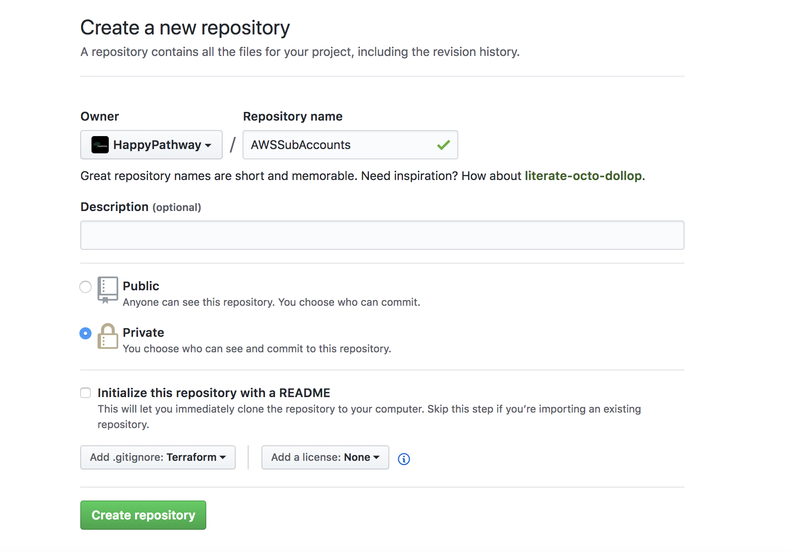
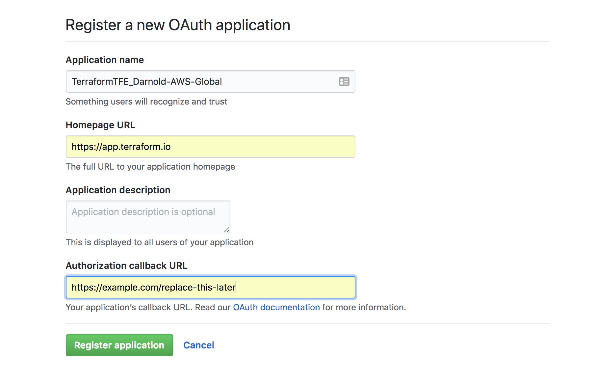

# AWS Account Management through Terraform and Vault AWS/AppRole
First we're gonna go through creating a brand new Terraform Enterprise Organization. In this organization, we will manage all of our AWS Accounts and any other global infrastructure. All the rest of our infrastructure will be delegated to our individual AWS Accounts.


## Repository Creation for AWSSubAccounts
We're going to manage all of our sub-accounts from one GitHub repository. We do not want to ever store our Terraform State files in GitHub as there could be unintended secrets that are checked in as well. Since we're going to be mostly managing Terraform code from this repository, we will go ahead and specify the Terraform template for our .gitignore file.


## Connect TFE Organization to GitHub
We're going to create a new GitHub Oauth App. 


## Create Organization API Token
We'll need to create an organization api token so that we can automate some of the setup of workspaces using the tfe command line tool. Make sure to add to ~/.tfe/Darnold-AWS-Global

## Workspace Creation for AWS SubAccounts
We're going to manage all of our sub-accounts from one workspace. In this workspace we will need to upload our Root Account IAM Credentials. *This should not be confused with root user credentials. Here we are only providing credentials that are tied to IAM accounts that are able to create sub-accounts. 
```bash
source ~/.tfe/Darnold-AWS-Global
tfe workspace new -tfe-workspace AWSSubAccounts -vcs-id HappyPathway/AWSSubAccounts
```


### Workspace Variable Setup
```bash
function push_vault_env {
   WS=${2}
   tfe_org=${1}
   source ~/.tfe/${tfe_org}
   tfe pushvars -name ${tfe_org}/${WS} \
   -senv-var "VAULT_TOKEN=${VAULT_TOKEN}" \
   -env-var "VAULT_ADDR=${VAULT_ADDR}"
}

push_vault_env Darnold-AWS-Global AWSSubAccounts
```

```bash
function push_aws {
  WS=${2}
  tfe_org=${1}
  source ~/.tfe/${tfe_org}
  tfe pushvars -name ${tfe_org}/${WS} \
  -senv-var "AWS_ACCESS_KEY_ID=${AWS_ACCESS_KEY_ID}" \
  -senv-var "AWS_SECRET_ACCESS_KEY=${AWS_SECRET_ACCESS_KEY}" \
  -env-var AWS_DEFAULT_REGION=us-east-1 
}

push_aws Darnold-AWS-Global AWSSubAccounts
```

```bash
function set_vars {
    WS=${2}
    tfe_org=${1}
    source ~/.tfe/${tfe_org}
    epoch=$(date +%s)
    export AWS_ACCOUNT_EMAIL=darnold+hashidemos-${epoch}@hashicorp.com
    export AWS_ACCOUNT_NAME=darnold-hashidemos-${epoch}
    tfe pushvars -name ${TFE_ORG}/${WS} \
    -var "aws_account_email=${AWS_ACCOUNT_EMAIL}" \
    -var "aws_account_name=${AWS_ACCOUNT_NAME}"
}
set_vars Darnold-AWS-Global AWSSubAccounts
```

### Run Initial TFE Run
It seems that Terraform Enterprise does not install proper webhooks on Repos until an initial run has succeeded.

### Add Terraform Config to new branch in GitHub repo.
In order to get a feel for the Terraform Enterprise Team Workflow, we're going to add our terraform configurqtion template to a new main.tf in a new branch. 